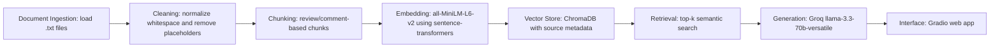

## Domain

I chose SJSU Computer Science professor and course reviews as my domain. This guide will help students search unofficial student opinions about CS professors, course workload, exams, grading, teaching style, and feedback quality.

This knowledge is valuable because official SJSU course catalogs explain what a course covers, but they do not explain what students actually experience in the class. Student reviews are scattered across Rate My Professors, Reddit threads, and informal student discussions, so a searchable RAG system can make that information easier to find.

## Documents

My source documents are plain text files stored in the `documents/` folder.

1. `documents/rmp_william_andreopoulos.txt` — Rate My Professors reviews for William Andreopoulos, especially CS149.
2. `documents/rmp_dominic_abucejo.txt` — Rate My Professors reviews for Dominic Abucejo, especially CS160.
3. `documents/rmp_frank_luo.txt` — Rate My Professors reviews for Frank Luo, especially CS157A.
4. `documents/reddit_andreopoulos_cs_courses.txt` — Reddit discussion about William Andreopoulos for CS courses.
5. `documents/reddit_cs149_professors.txt` — Reddit discussion comparing CS149 professors.
6. `documents/reddit_cs_department.txt` — Reddit discussion about the SJSU CS department.
7. `documents/reddit_cs_cmpe_professors.txt` — Reddit discussion about CS and CMPE professor experiences.
8. `documents/reddit_sjsu_cs_rank_discussion.txt` — Reddit discussion about SJSU CS reputation and student performance.
9. `documents/reddit_spartans_ultimate_guide.txt` — Reddit guide with general SJSU student advice and professor-selection advice.
10. `documents/reddit_cs_instructor_help.txt` — Reddit discussion asking for help choosing CS instructors.

These documents include a mix of short reviews, Reddit comments, student advice, and course-specific opinions. They cover teaching style, grading, workload, exams, office hours, self-learning, and professor selection.

## Chunking Strategy

I will split the documents by review/comment sections instead of splitting mechanically every fixed number of characters. Since my documents are mostly short Rate My Professors reviews and Reddit comments, each review or comment usually contains one complete idea. Keeping each review/comment together should make retrieval more meaningful.

My target chunk size is about 300–600 characters per chunk. If a review or comment is longer than that, I will split it into smaller paragraph-based chunks with about 100 characters of overlap. The overlap helps preserve context if a useful idea is spread across two adjacent chunks.

This strategy fits my corpus because review-heavy text is usually short and opinion-based. If chunks are too small, retrieval may return fragments like “lectures are boring” without the professor or course name. If chunks are too large, one chunk may mix unrelated topics such as exams, grading, internships, and department reputation, making semantic search less precise.

## Architecture

## Retrieval Approach

I will use `sentence-transformers` with the `all-MiniLM-L6-v2` embedding model. This model runs locally, does not require an API key, and is appropriate for a small student project because it is fast and free.

I will store embeddings in ChromaDB. Each chunk will include metadata such as the source filename and chunk number. This metadata is important because the final answer must cite which document the answer came from.

I will start with `top_k = 5`, meaning the system will retrieve the five most relevant chunks for each question. If top-k is too low, the correct information may be missed. If top-k is too high, the LLM may receive too much loosely related context and produce a less focused answer.

If this were a production system, I would compare embedding models based on accuracy, latency, cost, context length, multilingual support, and whether the system needs to run locally or through an API.

## Evaluation Plan

Question 1:
What do students say about William Andreopoulos for CS149?

Expected answer:
Students describe Andreopoulos as flexible and fair for CS149, but some say lectures can be boring and that students may rely more on slides, Zybooks, and homework than live lecture.

Question 2:
What do students say about Dominic Abucejo’s CS160 class?

Expected answer:
Students describe CS160 with Dominic Abucejo as useful for software engineering and full-stack project experience, with relatively easy quizzes or exams, but the group project can be difficult if teammates are weak.

Question 3:
What do students say about Frank Luo for CS157A?

Expected answer:
Students describe Frank Luo based on the collected CS157A reviews, especially comments about database instruction, workload, grading, and teaching style.

Question 4:
What advice do SJSU CS students give about choosing professors?

Expected answer:
Students say professor choice matters a lot, and they recommend checking student reviews, planning classes early, using resources, and understanding that some CS classes require self-learning.

Question 5:
What do students say about the overall SJSU CS department experience?

Expected answer:
Students describe the SJSU CS experience as valuable but dependent on effort. They mention good and bad professors, the need for self-learning, career preparation, clubs, tutoring, research, internships, and other resources.

## Anticipated Challenges

One challenge is that student reviews are noisy and subjective. Different students may disagree about the same professor, so the system should summarize patterns rather than treat one opinion as fact.

A second challenge is source attribution. The system must keep track of which file each chunk came from so generated answers can cite sources instead of sounding unsupported.

A third challenge is retrieval quality. If chunks are too short, the system may retrieve vague opinions without enough professor or course context. If chunks are too large, the retrieved chunks may contain several unrelated ideas.

A fourth challenge is out-of-scope questions. If a user asks about a professor or course not covered in the documents, the system should say it does not have enough information instead of hallucinating.

## AI Tool Plan

I plan to use AI tools to help implement specific parts of the system, but I will review and test the generated code.

For the ingestion and chunking script, I will provide the AI tool with my Documents section and Chunking Strategy section, then ask it to implement a Python script that loads `.txt` files, cleans whitespace, and creates review/comment-based chunks with source metadata.

For the retrieval code, I will provide the Retrieval Approach section and ask the AI tool to implement code using `sentence-transformers` and ChromaDB. I expect it to create embeddings, store chunks with metadata, and retrieve the top-k most relevant chunks for a query.

For the generation code, I will provide the grounding requirement and ask the AI tool to create a prompt that forces the LLM to answer only from retrieved context. I will check that the response includes source attribution and refuses to answer when the documents do not contain enough information.

For the Gradio interface, I will ask the AI tool to connect the final `ask()` function to a simple web app with a question input, answer output, and source list output.
